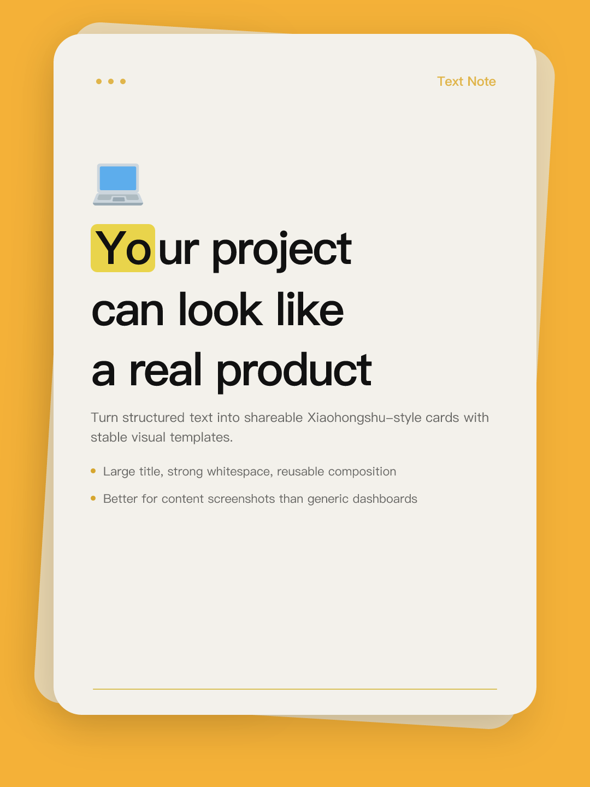
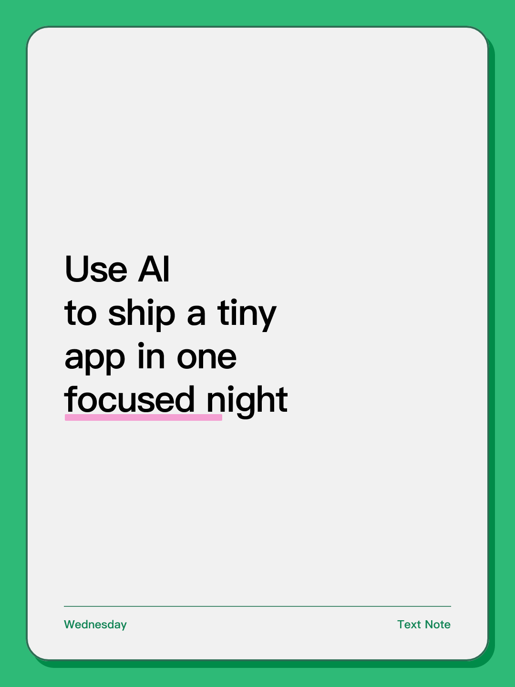
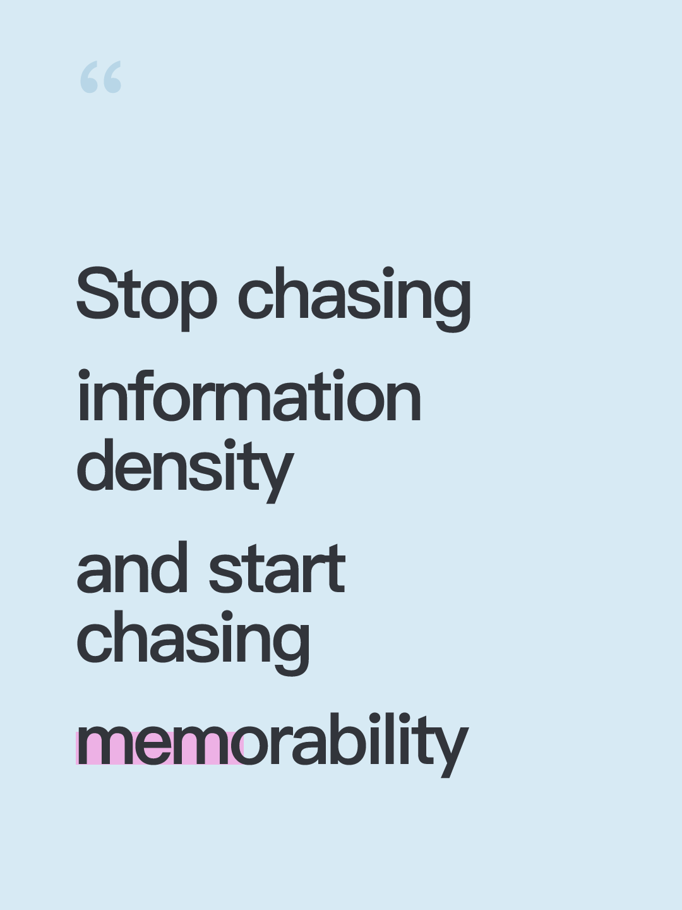
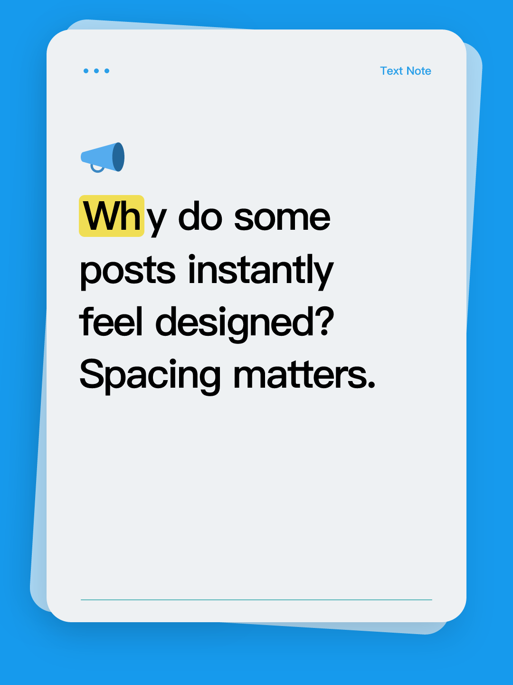

# postgen

`postgen` 是一个模板驱动的 **JSON -> PNG** CLI，核心目标不是做一个通用设计工具，而是**稳定输出小红书风格的文字模板**。

它把流程收敛成一个简单契约：

- 输入：一个 JSON 文件
- 选择：一个模板
- 输出：一张 PNG 图片

适合做：
- 小红书风格文字卡片
- 结论卡 / 引用卡 / Note 卡
- 标题海报
- 问答卡
- 榜单图
- 摘要图

## Showcase

当前模板输出效果示例：

### xhs-note



### xhs-note-green



### xhs-quote-blue



### xhs-note / blue



更多用于 README / 展示页的素材与示例数据放在：

- `website/shots/`
- `website/data/`
- `website/index.html`

## Quick Start

```bash
npm i
npm run build
npm link
```

查看模板：

```bash
postgen template --action list
```

导出模板示例：

```bash
postgen template --action init --name xhs-note --out ./note.json
# 或：
postgen template --action init --name xhs-quote-blue --out ./quote.json
```

渲染图片：

```bash
postgen render --template xhs-note --data ./note.json
# 或：
postgen render --template xhs-quote-blue --data ./quote.json
```

## Default Output Directory

如果不传 `--out`，默认输出到项目内的：

```bash
./out/
```

## Current Templates

- `xhs-note` — 主 Text Note 模板，当前支持 `cream` / `blue` 配色
- `xhs-note-green` — 绿色小红书 note 卡片
- `xhs-quote-blue` — 浅蓝极简引用风小红书卡片

## Docs

渐进式文档放在 `docs/`：

- `docs/README.md`
- `docs/getting-started.md`
- `docs/cli.md`
- `docs/templates.md`
- `docs/development.md`
